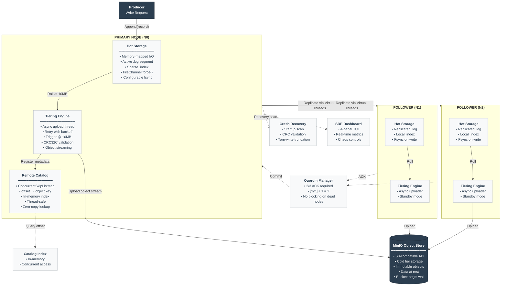

# Aegis-WAL

Write-ahead log implementation with tiered storage support. Hot data stays on local SSDs, cold data gets archived to S3/MinIO.

Built on Java 21.

## Architecture

```mermaid
flowchart TB
    %% Styling
    classDef producer fill:#2c3e50,color:#fff,stroke:#1a252f
    classDef primary fill:#34495e,color:#fff,stroke:#2c3e50
    classDef follower fill:#fff,color:#2c3e50,stroke:#95a5a6
    classDef internal fill:#f8f9fa,color:#2c3e50,stroke:#bdc3c7
    classDef minio fill:#2c3e50,color:#fff,stroke:#1a252f
    classDef tui fill:#16a085,color:#fff,stroke:#0e6655

    %% Producer
    P["<b>Producer</b><br/>Write Request"]
    class P producer

    %% Primary Node
    subgraph N0["<b>PRIMARY NODE (N0)</b>"]
        direction TB
        
        H["<b>Hot Storage</b><br/>━━━━━━━━━━━━━━━━<br/>• Memory-mapped I/O<br/>• Active .log segment<br/>• Sparse .index<br/>• FileChannel.force()<br/>• Configurable fsync"]
        
        T["<b>Tiering Engine</b><br/>━━━━━━━━━━━━━━━━<br/>• Async upload thread<br/>• Retry with backoff<br/>• Trigger @ 10MB<br/>• CRC32C validation<br/>• Object streaming"]
        
        C["<b>Remote Catalog</b><br/>━━━━━━━━━━━━━━━━<br/>• ConcurrentSkipListMap<br/>• offset → object key<br/>• In-memory index<br/>• Thread-safe<br/>• Zero-copy lookup"]
        
        H -->|"Roll at 10MB"| T
        T -->|"Register metadata"| C
    end
    class N0 primary
    class H,T,C internal

    %% Followers
    subgraph N1["<b>FOLLOWER (N1)</b>"]
        direction TB
        H1["<b>Hot Storage</b><br/>• Replicated .log<br/>• Local .index<br/>• Fsync on write"]
        T1["<b>Tiering Engine</b><br/>• Async uploader<br/>• Standby mode"]
        H1 -->|"Roll"| T1
    end
    class N1 follower
    class H1,T1 internal

    subgraph N2["<b>FOLLOWER (N2)</b>"]
        direction TB
        H2["<b>Hot Storage</b><br/>• Replicated .log<br/>• Local .index<br/>• Fsync on write"]
        T2["<b>Tiering Engine</b><br/>• Async uploader<br/>• Standby mode"]
        H2 -->|"Roll"| T2
    end
    class N2 follower
    class H2,T2 internal

    %% Storage
    M[("<b>MinIO Object Store</b><br/>━━━━━━━━━━━━━━━━<br/>• S3-compatible API<br/>• Cold tier storage<br/>• Immutable objects<br/>• Data at rest<br/>• Bucket: aegis-wal")]
    class M minio

    %% Additional Components
    Q["<b>Quorum Manager</b><br/>• 2/3 ACK required<br/>• ⌊3/2⌋ + 1 = 2<br/>• No blocking on dead nodes"]
    
    R["<b>Crash Recovery</b><br/>• Startup scan<br/>• CRC validation<br/>• Torn-write truncation"]
    
    TUI["<b>SRE Dashboard</b><br/>• 4-panel TUI<br/>• Real-time metrics<br/>• Chaos controls"]
    
    class Q,R,TUI internal

    %% All Connections
    P -->|"Append(record)"| H
    
    N0 -->|"Replicate via Virtual Threads"| N1
    N0 -->|"Replicate via Virtual Threads"| N2
    
    N1 -.->|"ACK"| Q
    N2 -.->|"ACK"| Q
    Q -.->|"Commit"| N0
    
    T -->|"Upload object stream"| M
    T1 -->|"Upload"| M
    T2 -->|"Upload"| M
    
    C -.->|"Query offset"| CAT["<b>Catalog Index</b><br/>• In-memory<br/>• Concurrent access"]
    
    N0 -.->|"Recovery scan"| R
    N0 -.->|"Export metrics"| TUI
    
    class CAT internal

```
